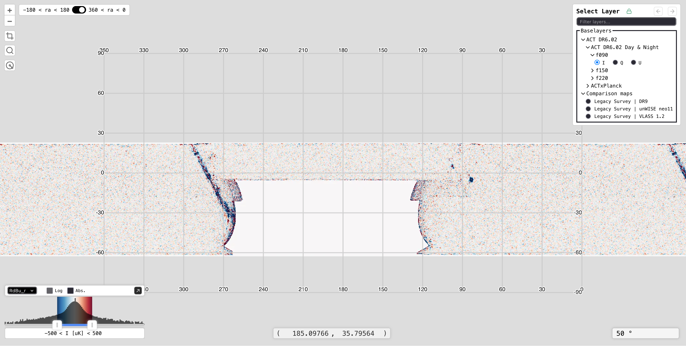

# Summary

`TileMaker`, along with its bundled frontend, `TileViewer`, is a tool for visualizing and analyzing astronomical maps with an equirectangular projection, like those produced by the Atacama Cosmology Telescope (ACT) and Simons Observatory (SO). `TileMaker` reads FITS files directly from disk to generate and serve map tiles on-the-fly without any pre-processing step. The `TileViewer` frontend then renders the map tiles using [OpenLayers](https://openlayers.org/). Additionally, `TileMaker` can serve data to the `TileViewer` that represent source catalogs and regions of interest.

`TileMaker` uses the HTTP protocol to serve the tiles over a network connection, meaning that the server running the analysis can be in a completely different place than where they are viewed. This allows users to view maps on their computer even when maps are stored on a remote machine (e.g. an HPC facility), thereby eliminating any need for large file transfers.

`TileMaker` can be used in a number of modes:

- Locally to visualize and organize a collection of maps
- Remotely over an SSH connection to view maps on an external machine
- In 'production' mode, served from a Docker container (see e.g. [the Simons Observatory main viewer](https://maps.simonsobservatory.org/))

# Statement of need

CMB and radio survey experiments such as ACT and SO produce multi-gigabyte, multi-layer FITS datasets that must be inspected routinely by large, geographically distributed collaboration members for data quality assessment, calibration validation, and science verification. These datasets are typically stored on remote HPC facilities, and the maps within them span a hierarchy of frequency bands, Stokes components, and data releases that must all be navigable in a single interface.

No existing general-purpose tool satisfies all of these requirements simultaneously. Desktop tools such as SAOImageDS9 [@ds9] require the data to be locally accessible and loaded into memory, which is impractical at survey scale. Browser-based tools such as Aladin Lite [@aladinlite] require data to be pre-ingested into the HiPS tile standard [@hips], which is incompatible with the equirectangular projection used by ACT and SO maps and impractical in an HPC environment. Purpose-built viewers such as the NASA LAMBDA ACT Viewer [@actviewer] demonstrate the value of a tile-based web interface for this class of data, but are hard-coded to a single data release and cannot be deployed by other teams against their own maps.

`TileMaker` addresses these gaps by serving tiles on-the-fly directly from FITS files over HTTP, with no pre-ingestion step, no ancillary files, and no data transfer. It is designed to run where the data live — including over an SSH tunnel from a laptop to an HPC facility — and to scale from single-user local inspection to multi-user production deployments via Docker and `memcached`. `TileViewer` provides the accompanying browser interface, with a graphical layer menu that reflects the full survey data hierarchy and supports the per-layer colormap adjustment, log-scale normalization, and Stokes-component switching that CMB map inspection requires.

# State of the field

**SAOImageDS9** [@ds9] is a desktop tool for astronomical image inspection. It reads FITS files directly and supports region manipulation, colormap manipulation, catalog overlays, and many more features. However, DS9 operates on locally accessible files and loads data entirely into memory, making it less practical for the datasets produced by wide-field CMB surveys. It also requires installation on the machine where the data reside, which conflicts with the common workflow of storing data on remote HPC facilities while performing interactive inspection on a laptop.

**Aladin Lite** [@aladinlite], developed by the Centre de Données astronomiques de Strasbourg (CDS), is a mature browser-based sky atlas that streams image data using the Hierarchical Progressive Survey (HiPS) standard [@hips]. HiPS is well-suited to all-sky optical and infrared surveys and is supported by a broad ecosystem of tools. However, adopting HiPS for SO Large Aperture Telescope (LAT) data introduces several practical obstacles. HiPS partitions the sphere using the HEALPix pixelization scheme [@healpix], which does not align with the Plate Carrée (CAR) projection adopted by SO LAT. Ingesting data into the HiPS format therefore requires a reprojection step that introduces interpolation artifacts and is irreversible. Furthermore, the standard HiPS ingestion pipeline (`hipsgen`) writes a large number of small tile files to disk — a significant burden on the parallel filesystems used at HPC facilities. The pipeline also requires transferring data to CDS infrastructure or running a dedicated `hipsgen` server, adding operational overhead that is undesirable for survey teams that need to inspect proprietary or pre-publication data privately. Aladin Lite additionally lacks built-in support for per-layer colormap manipulation, log-normalization, and Stokes-component switching that are routine operations when inspecting CMB polarization maps.

**FitsMap** [@fitsmap] is a Python tool developed at UC Santa Cruz for displaying large astronomical images and source catalogs in a browser using tile-based rendering powered by LeafletJS. Like `TileMaker`, it converts FITS files into image tiles that can be served over HTTP and viewed interactively without loading the full image into memory, and it supports catalog overlays with searchable markers. However, FitsMap's tile generation is a pre-processing step that writes tiled PNG directories to disk, rather than serving tiles on-the-fly from the original FITS files. It also uses [LeafletJS](https://leafletjs.com/) rather than OpenLayers as its map engine, which presents limitations when tile sizes differ between layers. FitsMap is primarily designed for deep-field imaging surveys — such as the DREaM galaxy catalog — rather than wide-field or full-sky CMB maps. FitsMap does not provide the multi-layer hierarchy, per-layer colormap manipulation, log-normalization, or Stokes-component switching required for CMB polarization data inspection.

**The NASA LAMBDA ACT Viewer** [@actviewer] is a purpose-built web viewer for the ACT DR5 data release, hosted at the NASA Legacy Archive for Microwave Background Data Analysis. It provides a tile-based, Google Maps-style interface for ACT maps and supports keyboard-driven switching between frequency bands (f090, f150, f220), Stokes components (T, Q, U, E, B), and data releases. It also supports region selection and FITS cutout download. However, the viewer is a static, dataset-specific deployment: the interface is hard-coded to the DR5 release and is not a general tool that survey teams can deploy against their own data. It does not expose a configuration interface, an API, or a mechanism for overlaying custom source catalogs or highlight regions. Keyboard-only navigation, while functional, is less discoverable than a graphical layer menu for users exploring an unfamiliar dataset with many bands and layers.

# Software design

The primary design decisions center on minimizing data transfers. `TileMaker` serves tiles over a network connection via HTTP protocol such that users can run `TileMaker` wherever the FITS files are stored, including on a remote HPC server, while viewing the maps in a local browser. Files therefore need not be transferred between environments solely for the purpose of inspection. Second, production versions can make use of `memcached` to reduce server loads. Finally, the `TileMaker` server in conjunction with the `TileViewer` only sends layer data on-demand to further reduce server loads. Since full layer data is only sent if and when a user requests the layer in the layer menu, a large number of FITS files can be registered with the server without adversely affecting application performance.

`TileViewer` is a single-page application built with TypeScript + React. React is mature, well documented, and remains a popular library for single-page applications. As such, using React ensures that there is a large community of developers capable of contributing to and maintaining the UI. TypeScript further improves the UI's maintainability by clearly defining expected types for server responses, React components, and data structures. In choosing between available map libraries, the two main contenders were OpenLayers and LeafletJS. Both are lightweight, versatile, open source, and widely used. Ultimately, OpenLayers was selected because it seamlessly handles arbitrary tile size differences between layers. Leaflet provides built-in support for varying tile sizes, but expects differences to be powers of two (e.g. 256 vs. 512 pixels); tile sizes in SO maps do not conform to this constraint, making OpenLayers the more suitable choice. `TileMaker` is built with Python + FastAPI and its [PyPI package](https://pypi.org/project/tilemaker/) includes the static, bundled `TileViewer` to make it a standalone, out-of-the-box web application. FastAPI was chosen for its ease of use, speed, and documentation.

# Research impact statement

`TileMaker` is in active use for ongoing Simons Observatory science operations. While a [production version](https://maps.simonsobservatory.org/) exists with limited public maps, there are hundreds of maps available to members of the Simons Observatory for data quality assessment, calibration validation, and science map inspection. Meanwhile, many other members of the Simons Observatory use `TileMaker` locally in their research.

# AI usage disclosure

In `TileViewer`, both ChatGPT-4o and Claude Sonnet 4.6 have been used in the following ways:

- planning and evaluating visualization libraries
- assisting with refactors pertaining to some functions and components
- investigating error logs
- analyzing described behavior and/or code to pinpoint bugs

AI-assisted and AI-generated code is reviewed and tested during code review via pull requests to verify its quality and correctness.

Claude Sonnet 4.6 was additionally used to suggest, edit, and proofread content for this paper.

# Acknowledgements

Funding was provided by National Science Foundation grant AST-2153201.

# References
